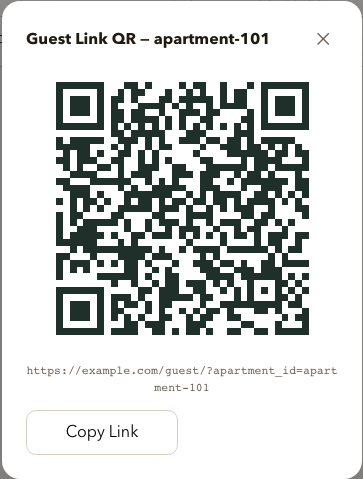
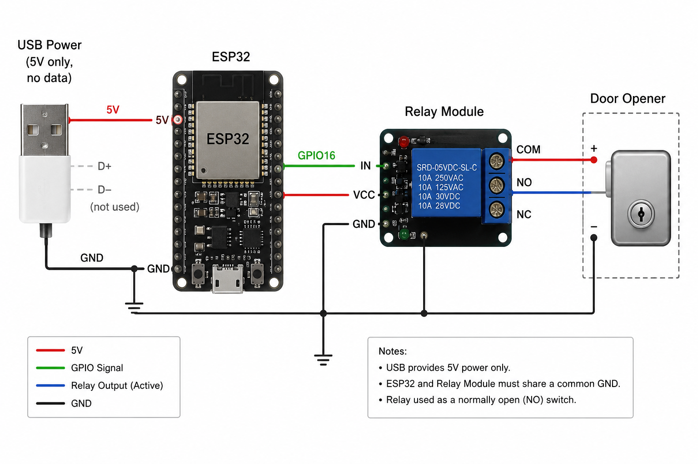
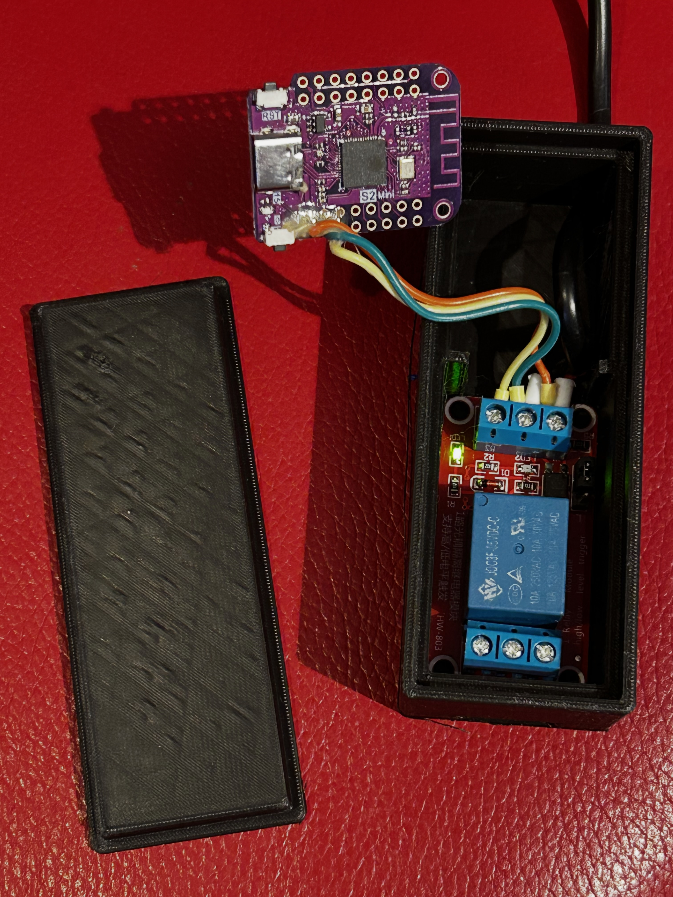

# FlatManager

**Secure, QR-based guest access for smart doors**

FlatManager is a complete door access solution for short-term guests. Guests scan a QR code, enter a time-limited access code, and instantly open the door via a secure HTTPS connection to an ESP8266 or ESP32 device connected to a relay that triggers the door opener contact.

## Key Features

- 🔐 **Secure**: HTTPS-only, hashed access codes, device tokens, rate limiting, complete audit logs
- 📱 **Guest-Friendly**: QR codes link directly to multilingual code-entry page (17+ languages)
- 🚪 **Reliable**: Long-poll connection ensures device is always reachable; manual override for emergencies
- 📊 **Observable**: Admin dashboard shows real-time device status, command tracking, access logs
- 🏗️ **Simple**: SQLite database, single Docker Compose setup, no external dependencies

## Architecture

```
Guest → QR Code → Web Form (HTTPS)
                 ↓
         Backend API (FastAPI)
         ├─ Validates code
         ├─ Creates command
         └─ Logs access
                 ↓
         ESP8266 Device (Long Poll)
         ├─ Waits for command
         └─ Triggers relay
```

The ESP8266 is **never publicly reachable** — it only initiates outbound HTTPS connections to the server.

---

## Quick Start

### Prerequisites
- Docker & Docker Compose
- Domain with HTTPS (Let's Encrypt recommended)
- ESP8266 with WiFi connectivity

### Build & Run

```bash
# Build and start all services
make prod-upd

# Or manually:
VITE_API_BASE_URL=https://your-domain.com make build upd
```

Services run on:
- Admin UI: `https://your-domain.com/admin/`
- Guest UI: `https://your-domain.com/guest/`
- API: `https://your-domain.com/api/`
- API Docs: `https://your-domain.com/api/docs`

---

## Guest Experience

The typical flow for a short-term guest (Airbnb, holiday flat, etc.):

1. **Before check-in** the host generates a QR code in the admin dashboard and shares it — printed on a welcome card, sent by message, or included in the booking confirmation.
2. **On arrival** the guest scans the code with their phone camera. No app required.
3. The browser opens directly to the door-open form, apartment ID already filled in.
4. The guest enters their time-limited access code and taps **Open Door**.
5. The backend validates the code, sends a command to the ESP device over a persistent HTTPS connection, and the relay triggers the door opener immediately.

<p align="center">
        
        <br><em>The admin generates a per-apartment QR code. Scanning it opens the guest form with the apartment pre-filled.</em>
</p>


They enter their code, press "Open Door", and see:
- ✅ **Success** → door opens, confirmation message shown.
- ❌ **Denied** → code invalid, expired, or not yet valid.
- ⏱️ **Timeout** → device unreachable; retry or contact host.

---

## Admin Dashboard

Admins manage **access codes**, **devices**, and monitor **commands & logs**:


Features:
- Create time-limited access codes with optional booking info
- Provision and rotate device tokens
- View real-time device online/offline status
- Track all access attempts and manual opens
- Generate **QR codes** per apartment for sharing

---

## Built Device Example

FlatManager includes complete hardware design and 3D models for building your own door opener device:

**Circuit Diagram (ESP32 relay configuration):**

<p align="center">
  
</p>

**Assembled Device (internal view):**

<p align="center">
  
</p>

**3D-Printable Housing:**


The device enclosure is available as a 3D model:
- **STL format**: [docs/models/DoorOpener v3.stl](docs/models/DoorOpener%20v3.stl) — Ready for any 3D printer
- **3MF format**: [docs/models/DoorOpener v3.3mf](docs/models/DoorOpener%20v3.3mf) — With material and color metadata

Designed for compact wall mounting on standard door frames with integrated relay and ESP32 device housing.

---

## Full Documentation

For detailed setup, configuration, troubleshooting, deployment guides, and hardware documentation, see:

📖 **[User Documentation](docs/USER_DOCUMENTATION.md)** — Complete step-by-step guide with screenshots, hardware info, and 3D models

---

## Project Structure

```
.
├── api/                 # FastAPI backend (Python)
│   ├── src/            # Application code
│   └── migrations/     # Database migrations (Alembic)
├── admin-ui/           # Admin dashboard (React + TypeScript)
├── guest-ui/           # Guest code-entry pages (React + TypeScript)
├── esp/            # Device firmware (PlatformIO)
├── docker-compose.yml  # Full stack orchestration
└── docs/               # User documentation & screenshots
```

---

## Security Principles

- ✅ HTTPS end-to-end (no plaintext over network)
- ✅ Access codes hashed with PEPPER + SHA256
- ✅ Device tokens are strong random values
- ✅ ESP device never publicly exposed (outbound only)
- ✅ Rate limiting per IP + per apartment
- ✅ Neutral error messages (no apartment enumeration)
- ✅ Complete access audit logs
- ✅ Short-lived commands (10 seconds default)
- ✅ Bounded relay pulse (server-side + device-side limits)

---

## Deployment

### Local Development
```bash
make up
```

### Production (with HTTPS domain)
```bash
VITE_API_BASE_URL=https://your-domain.com make build upd
```

Requires:
1. Nginx vhost configured (see `docs/USER_DOCUMENTATION.md`)
2. Let's Encrypt certificates in place
3. `.env` file with secrets (not committed to git)

### Clean Docker Build
```bash
./build-clean.sh
```
Removes old images and build cache to ensure no secrets are baked in.

---

## Configuration

Key environment variables (`api/.env`):

Generate strong random values with `openssl rand -hex 32`.

```env
ADMIN_TOKEN=your-secure-token
SECURITY_PEPPER=random-32-char-string
DOCS_URL=/api/docs
DEFAULT_OPEN_DURATION_MS=1500
LOCKOUT_FAILED_ATTEMPTS_THRESHOLD=5
```

See `api/.env.example` for all options.

---

## Device Setup (ESP8266 or ESP32 in esp/)

Currently configured boards in `esp/platformio.ini`:

| Environment | Board | Upload |
|---|---|---|
| `esp01_1m` | ESP8266 ESP-01S | USB/serial |
| `esp01_1m_ota` | ESP8266 ESP-01S | OTA |
| `lolin_s2_mini` | ESP32-S2 LOLIN S2 Mini | USB/serial |
| `lolin_s2_mini_ota` | ESP32-S2 LOLIN S2 Mini | OTA |

Configure your secrets in `esp/include/secrets.h`:

```cpp
#define FM_DEVICE_NAME "front-door"
#define FM_WIFI_SSID_1 "YourPrimaryNetwork"
#define FM_WIFI_PASSWORD_1 "YourPassword"
#define FM_WIFI_SSID_2 "YourFallbackNetwork"   // optional, leave "" to skip
#define FM_WIFI_PASSWORD_2 "YourPassword"
#define FM_WIFI_SSID_3 ""                       // optional, leave "" to skip
#define FM_WIFI_PASSWORD_3 ""
#define FM_API_BASE_URL "https://your-domain.com"
#define FM_DEVICE_TOKEN "token-from-admin-ui"
#define FM_OTA_PASSWORD "your-ota-password"
```

Board-specific parameters (relay GPIO, active level, LED pin) are set in
`esp/platformio.ini` under `[relay_esp01]` and `[relay_lolin_s2_mini]`.

Then build and upload via PlatformIO:

```bash
cd esp
pio run -t upload
```

---

## Support & Contributing

- For issues or feature requests, open an issue or PR
- For operational support, see the troubleshooting section in [User Documentation](docs/USER_DOCUMENTATION.md)

---

## License

[Specify your license here, e.g., MIT, GPL, etc.]

---

**Made for secure, frictionless guest access.** Questions? Check the [full documentation](docs/USER_DOCUMENTATION.md).
